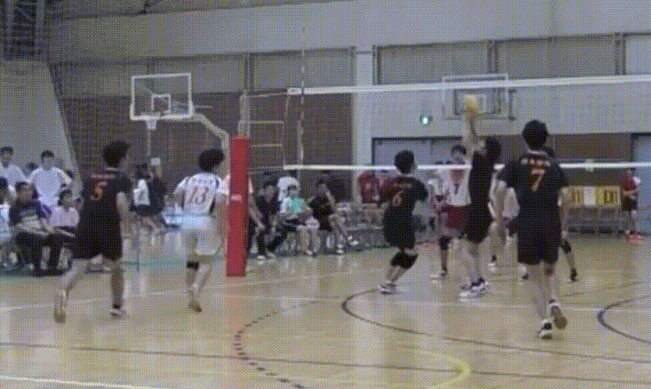
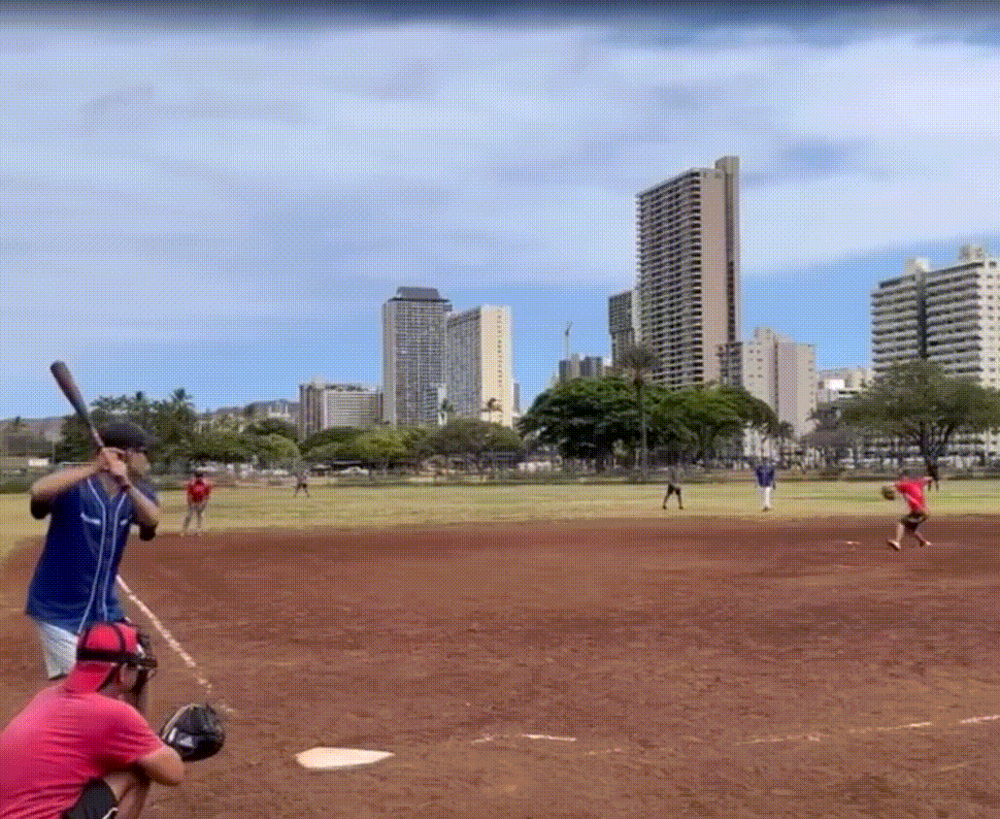

Hello! I’m Rei Miyashiro, a Data Science major at Chaminade University of Honolulu.\
I’m interested in data visualization, and sports analytics.

{width="250px"}

I am from Japan and I came Hawaii 2021. I graduated from KCC and transferd to Chaminade University.

{width="500px"}

I plyed vollyball in Japan for 8 years.

{width="500px"}

{width="500px"}

I love to watch baseball and play baseball. I also play softball or baseball almost every weekends.
