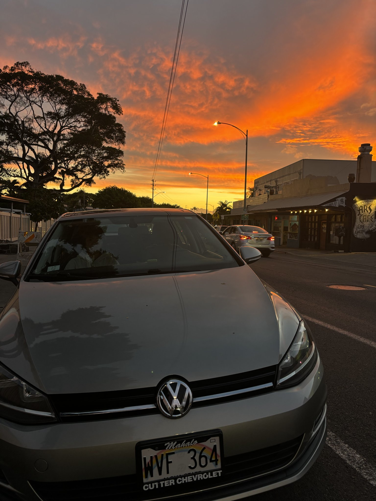

Hello! I’m Rei Miyashiro, a Data Science major at Chaminade University of Honolulu.\
I’m interested in data visualization, and sports analytics.

{width="250px" style="border-radius:50%;"}

I am from Japan and I came Hawaii 2021. I graduated from KCC and transferd to Chaminade University.

I play volleyball since I was 10 years old. I love to watch baseball and play baseball. I also play softball almost everyweekends.
